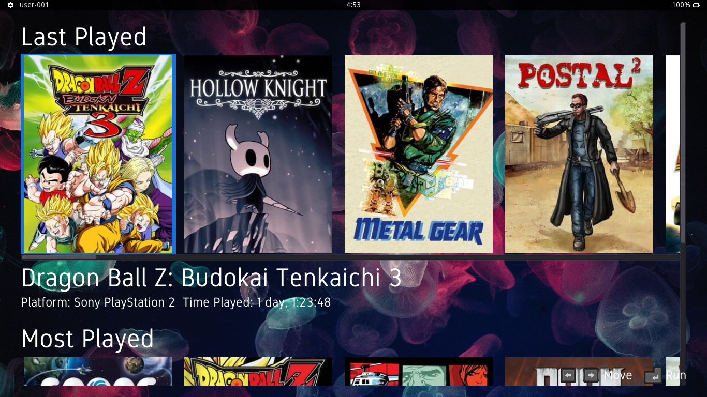

# Nutria

Lutris gamepad oriented UI made with Godot Engine.

## Screenshot

## Todo

- Options menu
- Fast start (loading things inside intro)
- Read real play time
- Better UI

## License

[Nutria GPL-3.0](LICENSE)  
[Lutris GPL-3.0](https://github.com/lutris/lutris/blob/master/LICENSE)  
[Godot MIT](https://github.com/godotengine/godot/blob/master/LICENSE.txt)
